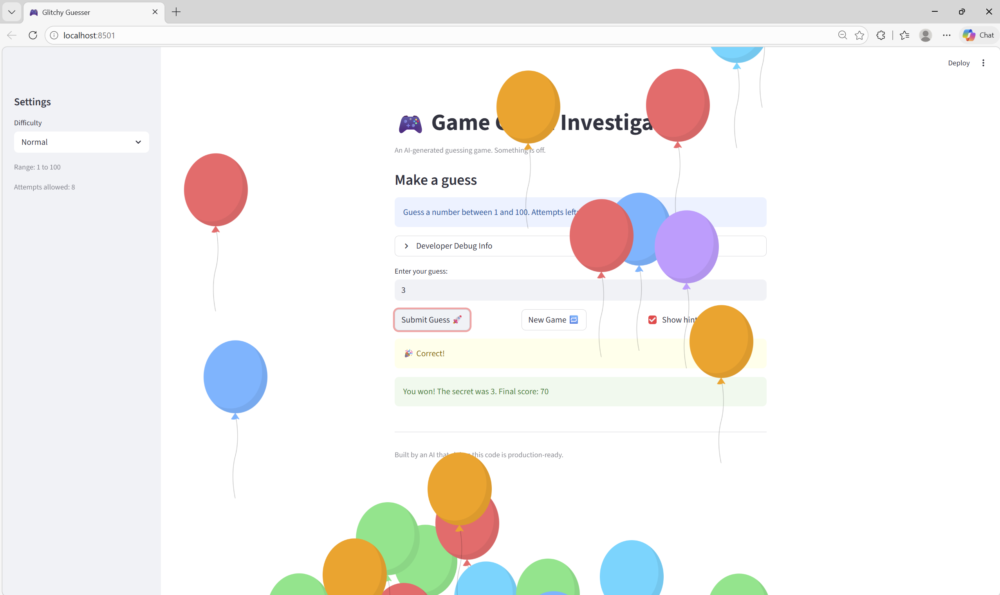

# 🎮 Game Glitch Investigator: The Impossible Guesser

## 🚨 The Situation

You asked an AI to build a simple "Number Guessing Game" using Streamlit.
It wrote the code, ran away, and now the game is unplayable. 

- You can't win.
- The hints lie to you.
- The secret number seems to have commitment issues.

## 🛠️ Setup

1. Install dependencies: `pip install -r requirements.txt`
2. Run the broken app: `python -m streamlit run app.py`

## 🕵️‍♂️ Your Mission

1. **Play the game.** Open the "Developer Debug Info" tab in the app to see the secret number. Try to win.
2. **Find the State Bug.** Why does the secret number change every time you click "Submit"? Ask ChatGPT: *"How do I keep a variable from resetting in Streamlit when I click a button?"*
3. **Fix the Logic.** The hints ("Higher/Lower") are wrong. Fix them.
4. **Refactor & Test.** - Move the logic into `logic_utils.py`.
   - Run `pytest` in your terminal.
   - Keep fixing until all tests pass!

## 📝 Document Your Experience

- [ ] Describe the game's purpose.
      The main purpose of this game is number guessing where the player tries to guess a secret number within a limited number of attempts and you can choose your own level of difficulty  and after each guesses the game tell you either to go up or down  id choosen secret number you won.  

- [ ] Detail which bugs you found.
      a. Bug 1 was secret number kept changing which is because of the Streamlit re-executed the entire script from top to bottom.
      b. Bug 2 was the hints were backwards as the original chech_guess function had the outcome labels swapped in that guess wining was almost impossible. 
      c. Bug 3 was even attempt string convesrion broke comparisons as the code converted the secret num to a string before comparision to the guess. 

- [ ] Explain what fixes you applied.
      fro bug 1 i wrapped the secret number assignment inside if "secret" not in st.session_state.
      for bug 2  i re write the whole check_guess so guess < secret returns "Too Low" paired with "Go HIGHER" and guess > secret returns "Too High" paired with "Go LOWER.
      and for bug 3 secret comared as integer. 

## 📸 Demo

- [ ] [Insert a screenshot of your fixed, winning game here]
      

## ✅ Pytest Evidence

- [ ] [Insert a screenshot of the pytest command and passing results here]
      

## 🚀 Stretch Features

- [ ] [If you choose to complete Challenge 4, insert a screenshot of your Enhanced Game UI here]
